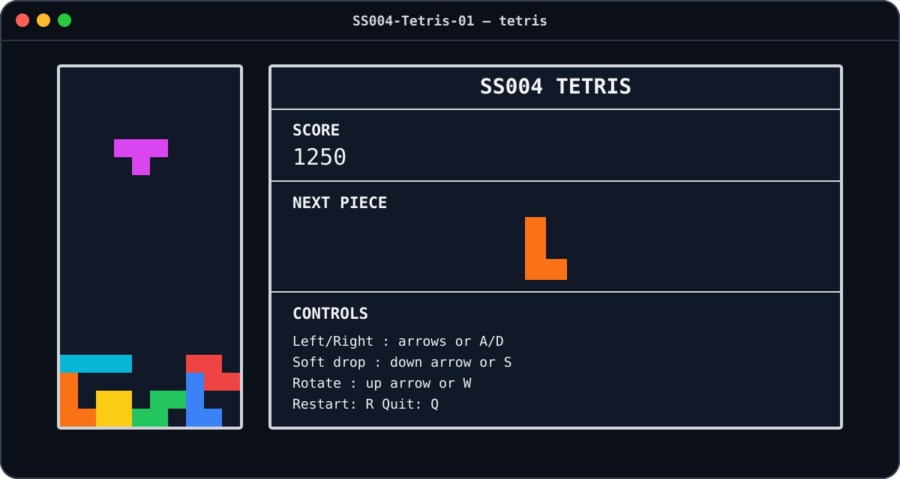
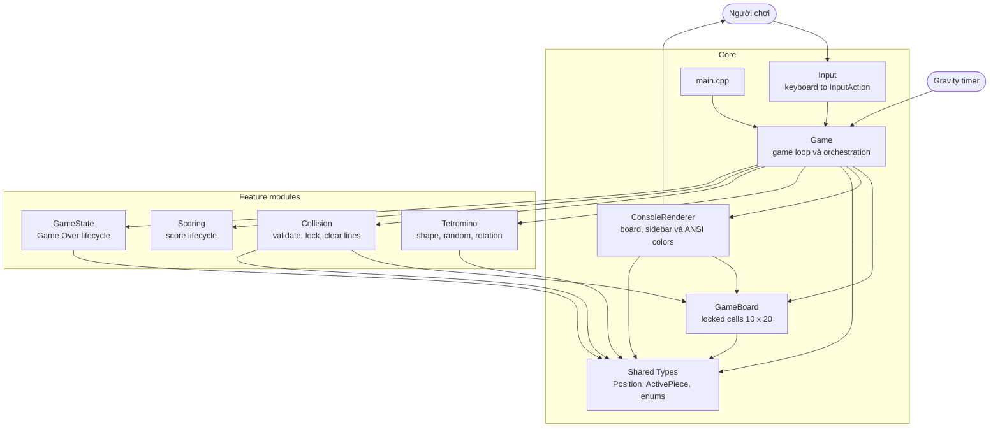
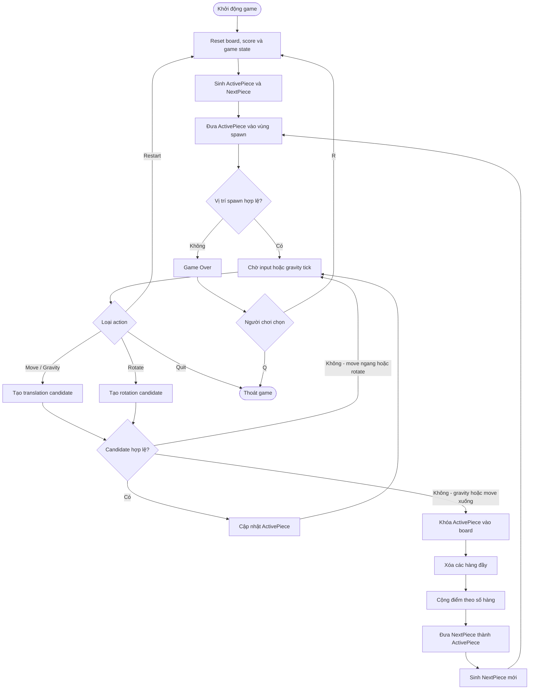
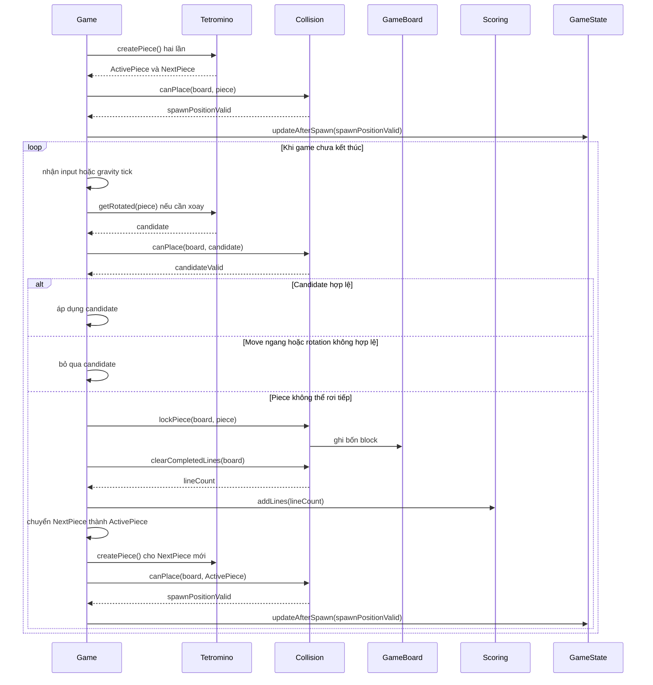
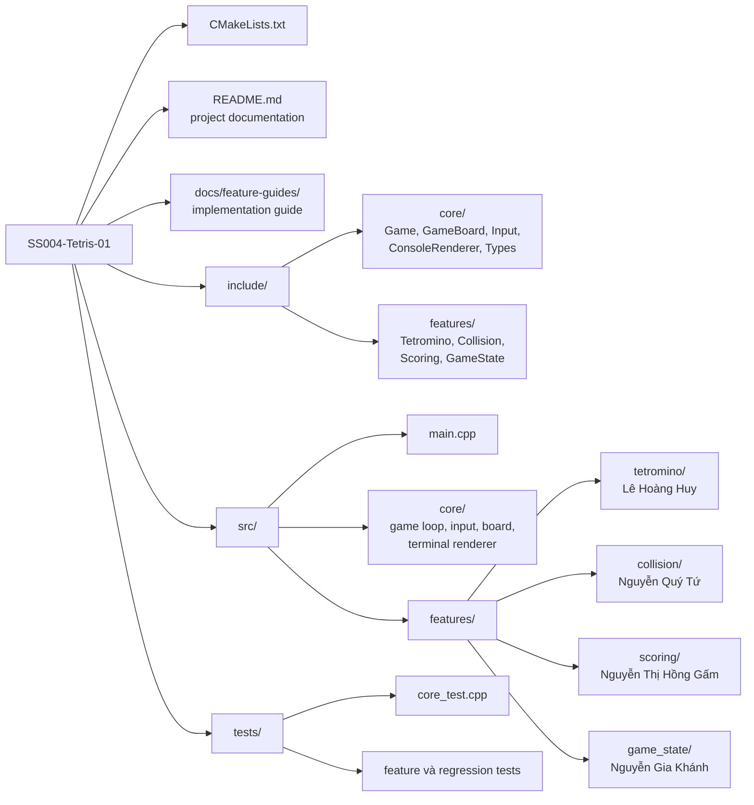
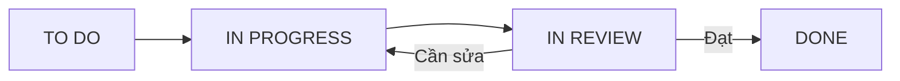

# SS004 - Tetris Game

Tài liệu tổng quan và hướng dẫn phát triển đồ án Tetris của Nhóm 01 trong môn
Kỹ năng nghề nghiệp - SS004, Trường Đại học Công nghệ Thông tin - ĐHQG TP.HCM.

## Giao diện



Game hiển thị bàn chơi 10 x 20 bên trái và bảng Score, Next Piece, Controls bên
phải. Mỗi loại Tetromino có một màu riêng và giữ nguyên màu sau khi được khóa.

## Mục lục

- [Thông tin dự án](#1-thông-tin-dự-án)
- [Mục tiêu dự án](#2-mục-tiêu-dự-án)
- [Phạm vi chức năng](#3-phạm-vi-chức-năng)
- [Thành phần của game](#4-thành-phần-của-game)
- [Hướng dẫn chơi](#5-hướng-dẫn-chơi)
- [Kiến trúc dự án](#6-kiến-trúc-dự-án)
- [Flow tổng thể](#7-flow-tổng-thể)
- [Thiết kế kỹ thuật](#8-thiết-kế-kỹ-thuật)
- [Cấu trúc repository](#9-cấu-trúc-repository)
- [Thành viên và phân công](#10-thành-viên-và-phân-công)
- [Build, chạy và kiểm thử](#11-build-chạy-và-kiểm-thử)
- [Quy trình làm việc nhóm](#12-quy-trình-làm-việc-nhóm)
- [Công cụ cộng tác](#13-công-cụ-cộng-tác)

## 1. Thông tin dự án

| Thuộc tính | Nội dung |
| --- | --- |
| Tên đồ án | SS004-Tetris-01 |
| Sản phẩm | Tetris chạy trên terminal |
| Nhóm | Nhóm 01 |
| Môn học | Kỹ năng nghề nghiệp - SS004 |
| Ngôn ngữ | C++17 |
| Build system | CMake 3.16 trở lên |
| Repository | [UIT-nhom-0x/SS004-Tetris-01](https://github.com/UIT-nhom-0x/SS004-Tetris-01) |

## 2. Mục tiêu dự án

### Mục tiêu sản phẩm

Xây dựng một phiên bản Tetris cơ bản, hoàn chỉnh và dễ sử dụng, có đầy đủ vòng
đời gameplay từ lúc bắt đầu cho đến Game Over và Restart.

### Mục tiêu học tập

| Mục tiêu | Nội dung |
| --- | --- |
| Làm việc nhóm | Phân chia module, phối hợp feature và review chéo |
| Quản lý công việc | Theo dõi owner, tiến độ và trạng thái task |
| Phát triển phần mềm | Thiết kế, cài đặt và kiểm thử bằng C++ |
| Quản lý source code | Làm việc với branch, commit, pull request và merge |
| Kiểm thử | Viết test, báo lỗi và thực hiện regression testing |
| Tài liệu kỹ thuật | Duy trì kiến trúc, contract và hướng dẫn trong README |

### Mục tiêu của người chơi

Người chơi điều khiển các Tetromino đang rơi để tạo thành hàng ngang hoàn chỉnh.
Mỗi hàng đầy được xóa để giải phóng không gian và tăng điểm. Người chơi cố gắng
duy trì lượt chơi lâu nhất có thể, đồng thời tránh để các khối tích lũy đến vùng
sinh khối ở phía trên bàn chơi.

## 3. Phạm vi chức năng

Phần này mô tả phạm vi của sản phẩm hoàn chỉnh sau khi các feature do từng
thành viên phụ trách được tích hợp.

| Nhóm chức năng | Yêu cầu |
| --- | --- |
| Game Board | Bàn chơi cố định 10 cột x 20 hàng; mỗi ô ở trạng thái trống hoặc đã bị chiếm |
| Tetromino | Hỗ trợ đủ bảy khối I, O, T, S, Z, J và L |
| Random Piece | Sinh ngẫu nhiên Tetromino khi bắt đầu game và sau khi khóa một khối |
| Next Piece | Hiển thị trước Tetromino sẽ xuất hiện ở lượt kế tiếp |
| Gravity | ActivePiece tự động rơi theo tick thời gian |
| Movement | Di chuyển trái, phải và xuống nhanh hơn nếu vị trí mới hợp lệ |
| Rotation | Xoay ActivePiece theo chiều kim đồng hồ; bỏ qua phép xoay không hợp lệ |
| Collision | Kiểm tra biên trái/phải, đáy và các ô đã bị chiếm |
| Piece Locking | Cố định ActivePiece vào GameBoard khi không thể rơi tiếp |
| Line Clearing | Phát hiện hàng đầy, xóa hàng và dồn các hàng phía trên xuống |
| Scoring | Cập nhật và hiển thị điểm dựa trên số hàng được xóa |
| Color Renderer | Hiển thị màu riêng cho từng loại Tetromino trên terminal hỗ trợ ANSI |
| Game Over | Kết thúc lượt chơi nếu Tetromino mới không thể xuất hiện ở vị trí spawn |
| Restart | Reset board, score, game state và sinh Tetromino mới mà không khởi động lại chương trình |
| Quit | Cho phép người chơi thoát khỏi game |

### Ngoài phạm vi

| Không triển khai | Không triển khai |
| --- | --- |
| Tài khoản hoặc đăng nhập | Multiplayer |
| Database | Online leaderboard |
| Shop hoặc skin | AI |
| Server | Backend |

## 4. Thành phần của game

### Bàn chơi

| Thuộc tính | Giá trị |
| --- | --- |
| Chiều rộng | 10 cột |
| Chiều cao | 20 hàng |
| Gốc tọa độ | Góc trên bên trái `(0, 0)` |
| Chiều tăng của `x` | Từ trái sang phải, trong `[0, 9]` |
| Chiều tăng của `y` | Từ trên xuống dưới, trong `[0, 19]` |
| Trạng thái ô | `Empty` hoặc loại Tetromino `I`, `O`, `T`, `S`, `Z`, `J`, `L` |

`GameBoard` chỉ lưu các block đã được khóa. Tetromino đang rơi được lưu riêng
trong `ActivePiece` và được ghép với board khi render.

### Tetromino

| Loại | Hình dạng mô tả |
| --- | --- |
| I | Bốn block trên một đường thẳng |
| O | Hình vuông 2 x 2 |
| T | Ba block nằm ngang và một block ở giữa |
| S | Hai cặp block lệch nhau theo dạng chữ S |
| Z | Hai cặp block lệch nhau theo dạng chữ Z |
| J | Ba block nằm ngang và một block ở đầu bên trái |
| L | Ba block nằm ngang và một block ở đầu bên phải |

Mỗi `ActivePiece` gồm loại Tetromino, trạng thái xoay, tâm xoay và đúng bốn tọa
độ block tuyệt đối trên bàn chơi.

### Màu Tetromino

| Tetromino | Màu terminal |
| --- | --- |
| I | Cyan |
| O | Vàng |
| T | Tím |
| S | Xanh lá |
| Z | Đỏ |
| J | Xanh dương |
| L | Cam |

Renderer dùng hai khoảng trắng có màu nền cho mỗi block để giữ tỉ lệ gần vuông.
Khi output không phải terminal tương tác, renderer tự dùng `[]` và bỏ mã màu
ANSI để log hoặc kết quả test vẫn đọc được.

## 5. Hướng dẫn chơi

### Điều khiển

| Phím | Thao tác |
| --- | --- |
| `←` hoặc `A` | Di chuyển Tetromino sang trái |
| `→` hoặc `D` | Di chuyển Tetromino sang phải |
| `↓` hoặc `S` | Di chuyển Tetromino xuống nhanh hơn |
| `↑` hoặc `W` | Xoay Tetromino theo chiều kim đồng hồ |
| `R` | Bắt đầu lại lượt chơi |
| `Q` | Thoát game |

Game chuyển terminal tương tác sang chế độ đọc tức thời, vì vậy các phím điều
khiển có hiệu lực ngay mà không cần nhấn Enter. Khi game kết thúc, cấu hình
terminal ban đầu được khôi phục tự động.

### Luật chơi

| Bước | Hoạt động |
| --- | --- |
| 1 | Game reset board, điểm và trạng thái, sau đó sinh ActivePiece và NextPiece |
| 2 | Tetromino tự động rơi; người chơi có thể di chuyển hoặc xoay |
| 3 | Mọi candidate position phải được Collision xác nhận trước khi áp dụng |
| 4 | Khi không thể rơi tiếp, Tetromino được khóa vào GameBoard |
| 5 | Game phát hiện và xóa tất cả hàng đầy, sau đó cập nhật điểm |
| 6 | NextPiece thành ActivePiece, một NextPiece mới được sinh và chu trình tiếp tục |
| 7 | Nếu vị trí spawn không hợp lệ, game chuyển sang Game Over |
| 8 | Người chơi nhấn `R` để chơi lại hoặc `Q` để thoát |

## 6. Kiến trúc dự án

`Game` là lớp điều phối trung tâm. Core sở hữu game loop, input, board và thứ tự
gọi module. Các feature nhận dữ liệu qua public contract, không tự đọc input,
không tự render và không truy cập state private của `Game`.



### Nguyên tắc phụ thuộc

| Thành phần | Được phép phụ thuộc | Không chịu trách nhiệm |
| --- | --- | --- |
| `Game` | Core và toàn bộ feature API | Cài đặt thuật toán riêng của từng feature |
| `GameBoard` | Shared types | Input, scoring hoặc sinh Tetromino |
| `Input` | `InputAction` | Thay đổi trực tiếp game state |
| `ConsoleRenderer` | `GameBoard`, active/next piece, score và game-over flag | Thay đổi gameplay state |
| `Tetromino` | Shared types | Kiểm tra board hoặc tự áp dụng rotation |
| `Collision` | `GameBoard`, `ActivePiece` | Scoring hoặc game loop |
| `Scoring` | Số hàng đã xóa | Tự phát hiện/xóa hàng |
| `GameState` | Kết quả kiểm tra spawn | Tự reset các module khác |

## 7. Flow tổng thể



### Thứ tự tích hợp một piece



## 8. Thiết kế kỹ thuật

### Công nghệ

| Thành phần | Lựa chọn |
| --- | --- |
| Ngôn ngữ | C++17 |
| Build system | CMake 3.16+ |
| Giao diện | Terminal/console |
| Thư viện ngoài | Không sử dụng |
| Game timing | `std::chrono::steady_clock` |
| Gravity interval | 500 ms |
| Game-loop sleep | 16 ms để tránh busy-wait |
| Input trên Windows | `_kbhit()` và `_getch()`; hỗ trợ mã phím mũi tên |
| Input trên macOS/Linux | `termios`, `select()` và `read()`; giải mã ANSI escape sequence |
| Terminal rendering | Board và sidebar cố định trong alternate screen buffer |
| Tetromino colors | ANSI background color; fallback `[]` khi output không phải TTY |
| Kích thước frame | 59 cột x 22 dòng |
| Test runner | CTest |

### Shared data contract

| Kiểu | Ý nghĩa |
| --- | --- |
| `Position` | Tọa độ block tuyệt đối `(x, y)` |
| `CellState` | `Empty` hoặc loại Tetromino của block đã khóa để bảo toàn màu |
| `InputAction` | Action độc lập với phím vật lý |
| `TetrominoType` | Loại I, O, T, S, Z, J hoặc L |
| `RotationState` | Hướng `Spawn`, `Right`, `Reverse` hoặc `Left` |
| `ActivePiece` | Loại, hướng, tâm xoay và bốn block của piece hiện tại |

Movement và rotation phải tạo candidate mới. `ActivePiece` thật chỉ được cập
nhật sau khi `Collision::canPlace()` xác nhận candidate hợp lệ. Cách làm này giữ
mọi thay đổi mang tính atomic và tránh phải rollback state.

### Public module contract

| Module | Public API | Contract |
| --- | --- | --- |
| `GameBoard` | `reset`, `isInside`, `getCell`, `setCell` | Sở hữu và bảo vệ truy cập lưới 10 x 20 |
| `Input` | `pollAction`, `fromCharacter` | Quản lý terminal bằng RAII, poll không blocking và ánh xạ phím thành action |
| `Game` | `run`, `moveCurrentPiece`, `tick`, `restart`, `nextPiece` | Điều phối vòng đời game và active/next piece |
| `ConsoleRenderer` | `buildFrame` | Tạo frame board, score, preview, controls và Game Over mà không đổi state |
| `Tetromino` | `createPiece`, `getRotated` | Trả về piece/candidate; không thay đổi board |
| `Collision` | `canPlace`, `lockPiece`, `clearCompletedLines` | Validate và thay đổi board trong phạm vi collision/line clear |
| `Scoring` | `reset`, `addLines`, `getScore` | Sở hữu score; nhận số hàng đã được Collision xóa |
| `GameState` | `isGameOver`, `updateAfterSpawn`, `reset` | Sở hữu trạng thái Game Over dựa trên kết quả spawn |

### Quy tắc dành cho feature implementation

| Quy tắc | Yêu cầu |
| --- | --- |
| Candidate first | Không mutate ActivePiece trước khi Collision xác nhận |
| Single owner | Mỗi state chỉ có một module sở hữu |
| No hidden I/O | Feature không đọc bàn phím hoặc in ra terminal |
| Explicit result | Line clearing trả về `lineCount`; spawn check trả về boolean |
| Public contract | Đổi shared type hoặc feature header phải được Team Lead review |
| Testability | Mọi thuật toán có deterministic entry point để viết test |

## 9. Cấu trúc repository



CMake tự phát hiện file `.cpp` trong `src/features/`. Thành viên thêm source vào
đúng thư mục của mình mà không cần sửa đồng thời `CMakeLists.txt`, nhờ đó giảm
conflict giữa các feature branch.

Hướng dẫn chi tiết cho từng feature owner nằm tại
[`docs/feature-guides/README.md`](docs/feature-guides/README.md).

## 10. Thành viên và phân công

| MSSV | Thành viên | Vai trò | Phạm vi phụ trách | Thư mục chính |
| --- | --- | --- | --- | --- |
| 26730022 | Nguyễn Mạnh Hùng | Team Lead | Core, board, renderer, architecture, game loop, input, movement, review và integration | `include/core/`, `src/core/` |
| 26730027 | Lê Hoàng Huy | Developer | Tetromino, random piece, dữ liệu cho Next Piece, rotation và hỗ trợ tài liệu | `include/features/Tetromino.hpp`, `src/features/tetromino/` |
| 26730078 | Nguyễn Quý Tứ | Developer | Collision, piece locking, line detection và line clearing | `include/features/Collision.hpp`, `src/features/collision/` |
| 26730014 | Nguyễn Thị Hồng Gấm | Developer / Tester | Scoring, gameplay testing, bug report và regression testing | `include/features/Scoring.hpp`, `src/features/scoring/`, `tests/` |
| 26730032 | Nguyễn Gia Khánh | Developer | Game Over, Restart và reset game state | `include/features/GameState.hpp`, `src/features/game_state/` |

### Trách nhiệm integration

| Công việc | Feature owner | Team Lead |
| --- | --- | --- |
| Thiết kế thuật toán trong phạm vi được giao | Thực hiện | Review |
| Cài đặt source và unit test | Thực hiện | Hỗ trợ contract |
| Thay đổi public API | Đề xuất | Phê duyệt và kiểm tra ảnh hưởng |
| Kết nối feature vào `Game` | Hỗ trợ | Thực hiện |
| Regression test toàn hệ thống | Phối hợp | Xác nhận trước khi merge |

## 11. Build, chạy và kiểm thử

### Yêu cầu môi trường

| Công cụ | Phiên bản |
| --- | --- |
| C++ compiler | Hỗ trợ C++17 |
| CMake | 3.16 trở lên |
| Terminal | Tối thiểu 59 cột x 22 dòng; hỗ trợ ANSI để hiển thị màu |

### Build

```sh
cmake -S . -B build
cmake --build build
```

Nếu repository được di chuyển và CMake báo
`CMakeCache.txt directory ... is different`, hãy tạo build directory mới hoặc
xóa cache build cũ rồi cấu hình lại.

### Chạy game

```sh
./build/tetris
```

### Chạy test

```sh
ctest --test-dir build --output-on-failure
```

## 12. Quy trình làm việc nhóm

### Trạng thái task



### Feature branch

| Branch | Phạm vi |
| --- | --- |
| `feature/core-game` | Core architecture và integration |
| `feature/tetromino-rotation` | Tetromino, random/next piece và rotation |
| `feature/collision-line-clear` | Collision, locking và line clearing |
| `feature/scoring` | Scoring và scoring tests |
| `feature/game-over-restart` | Game Over, Restart và state reset |

### Quy trình Git và review

| Bước | Yêu cầu |
| --- | --- |
| 1 | Feature branch được tạo hoặc cập nhật từ cùng baseline trên `main` |
| 2 | Thành viên chỉ triển khai phạm vi được giao và bổ sung test tương ứng |
| 3 | Thay đổi shared contract phải được trao đổi trước khi code |
| 4 | Thành viên tự build và chạy toàn bộ test trên local |
| 5 | Pull request được chuyển sang review; feature owner xử lý feedback |
| 6 | Team Lead tích hợp, chạy regression test và xác nhận trước khi merge |

### Tiêu chí hoàn thành

| Tiêu chí | Điều kiện |
| --- | --- |
| Phạm vi | Đúng task và đúng module ownership |
| Build | Biên dịch thành công, không có warning mới |
| Test | Có test cho happy path và trường hợp biên; toàn bộ CTest pass |
| Contract | Không phá vỡ shared API đã thống nhất |
| Review | Được Team Lead review và xác nhận |
| Ownership | Người được phân công trực tiếp commit và giải thích được code |

## 13. Công cụ cộng tác

| Công cụ | Mục đích | Liên kết |
| --- | --- | --- |
| GitHub / Git | Source code, branch, commit, review và merge | [Repository](https://github.com/UIT-nhom-0x/SS004-Tetris-01) |
| Trello | Phân công task, deadline và theo dõi tiến độ | [SS004 Tetris 01](https://trello.com/b/ekmtesTV/ss004-tetris-01) |
| Slack | Trao đổi công việc và vấn đề kỹ thuật | [Kênh của nhóm](https://ss004f31.slack.com/archives/C0BV25QV3L5) |
| Overleaf / LaTeX | Soạn thảo và quản lý báo cáo | [Báo cáo nhóm](https://www.overleaf.com/read/xkrvvtjdcpzm#2eb4c6) |
