# Hướng dẫn triển khai feature

Tài liệu này dành cho các thành viên triển khai feature sau khi core architecture
đã được tích hợp vào `main`. Mục tiêu là giúp mỗi người biết chính xác phạm vi,
file cần tạo, public contract phải tuân thủ, test cần viết và dữ liệu cần bàn giao
cho Team Lead tích hợp.

README ở thư mục gốc là tài liệu tổng thể của dự án. File này chỉ bổ sung hướng
dẫn implementation theo từng module.

## 1. Nguyên tắc chung

| Nguyên tắc | Yêu cầu |
| --- | --- |
| Đúng ownership | Chỉ sửa header/source thuộc feature được giao |
| Giữ shared contract | Không tự ý đổi `include/core/` hoặc chữ ký public method |
| Không hidden I/O | Feature không đọc bàn phím và không in ra terminal |
| Candidate first | Movement/rotation tạo bản sao; chỉ `Game` áp dụng sau khi Collision xác nhận |
| Single responsibility | Mỗi module chỉ sở hữu state và thuật toán trong phạm vi của mình |
| Deterministic test | Luôn có cách tạo dữ liệu xác định để unit test |
| Không tích hợp chéo | Feature owner không tự sửa orchestration trong `Game.cpp` |
| Review contract trước | Nếu contract hiện tại không đủ, trao đổi với Hùng trước khi code |

### Những file dùng chung không tự ý sửa

| File/thư mục | Lý do |
| --- | --- |
| `include/core/Types.hpp` | Contract dữ liệu mà mọi feature cùng sử dụng |
| `include/core/Game.hpp` | Public API và state của game loop |
| `src/core/Game.cpp` | Điểm integration do Team Lead quản lý |
| `include/core/GameBoard.hpp` | Contract board dùng bởi Collision và Game State |
| `include/core/ConsoleRenderer.hpp` | Contract hiển thị board, sidebar và màu ANSI |
| `src/core/ConsoleRenderer.cpp` | Renderer dùng chung do Hùng quản lý |
| `CMakeLists.txt` | Build configuration dùng chung cho cả nhóm |

Nếu thực sự cần thay đổi một file dùng chung, feature owner mô tả nhu cầu, ảnh
hưởng và test liên quan để Team Lead review trước.

## 2. Vị trí code của từng thành viên

| Thành viên | Branch | Header contract | Source cần tạo | Test đề xuất |
| --- | --- | --- | --- | --- |
| Lê Hoàng Huy | `feature/tetromino-rotation` | `include/features/Tetromino.hpp` | `src/features/tetromino/Tetromino.cpp` | `tests/tetromino_test.cpp` |
| Nguyễn Quý Tứ | `feature/collision-line-clear` | `include/features/Collision.hpp` | `src/features/collision/Collision.cpp` | `tests/collision_test.cpp` |
| Nguyễn Thị Hồng Gấm | `feature/scoring` | `include/features/Scoring.hpp` | `src/features/scoring/Scoring.cpp` | `tests/scoring_test.cpp` |
| Nguyễn Gia Khánh | `feature/game-over-restart` | `include/features/GameState.hpp` | `src/features/game_state/GameState.cpp` | `tests/game_state_test.cpp` |
| Nguyễn Mạnh Hùng | `feature/core-game` hoặc integration branch | `include/core/` | `src/core/` | `tests/core_test.cpp`, integration tests |

Các file `.cpp` đặt dưới `src/features/` được CMake nhận tự động. Feature owner
không cần thêm source implementation vào `CMakeLists.txt`.

File test mới chưa được đăng ký tự động. Hãy tạo test trong `tests/` và gửi tên
file cho Hùng để đăng ký test target trong CMake, tránh nhiều branch cùng sửa
`CMakeLists.txt`.

## 3. Shared data contract

| Kiểu | Cách sử dụng |
| --- | --- |
| `Position` | Tọa độ tuyệt đối trên board; `(0, 0)` ở góc trên bên trái |
| `CellState` | `Empty` hoặc loại I/O/T/S/Z/J/L của block đã khóa |
| `TetrominoType` | Một trong I, O, T, S, Z, J hoặc L |
| `RotationState` | `Spawn`, `Right`, `Reverse`, `Left` theo thứ tự xoay clockwise |
| `ActivePiece::type` | Loại Tetromino hiện tại |
| `ActivePiece::rotation` | Hướng hiện tại của Tetromino |
| `ActivePiece::origin` | Tâm tham chiếu cho rotation |
| `ActivePiece::blocks` | Đúng bốn tọa độ block tuyệt đối |
| `translated(piece, dx, dy)` | Tạo movement candidate mà không sửa piece gốc |
| `Game::nextPiece()` | Piece kế tiếp do Game giữ để `ConsoleRenderer` hiển thị preview |

Mọi `ActivePiece` hợp lệ phải có đúng bốn block khác nhau. Tetromino tạo và xoay
piece; Collision kiểm tra piece; Game quyết định có áp dụng candidate hay không.

## 4. Huy - Tetromino, random piece và rotation

### Phạm vi

| Cần triển khai | Không triển khai trong module này |
| --- | --- |
| Bảy hình I, O, T, S, Z, J, L | Collision với board |
| Spawn position cho từng hình | Khóa piece vào board |
| Random piece cho active/next queue | Xóa hàng hoặc cộng điểm |
| Clockwise rotation candidate | Đọc input và render |
| Cập nhật `RotationState` | Tự áp dụng candidate vào `Game` |

### Public method phải implement

```cpp
ActivePiece Tetromino::createPiece();
ActivePiece Tetromino::createPiece(TetrominoType type) const;
ActivePiece Tetromino::getRotated(const ActivePiece& piece) const;
```

### Yêu cầu chi tiết

#### `createPiece(TetrominoType type)`

1. Trả về đúng `type` được yêu cầu.
2. Đặt `rotation` thành `RotationState::Spawn`.
3. Đặt `origin` và bốn block ở vùng spawn, không vượt biên ngang.
4. Luôn tạo đúng bốn tọa độ khác nhau.
5. Không đọc hoặc thay đổi `GameBoard`.

Gợi ý spawn layout dùng chung:

| Type | `origin` | Bốn block ở trạng thái Spawn |
| --- | --- | --- |
| I | `(4, 1)` | `(3,1) (4,1) (5,1) (6,1)` |
| O | `(4, 0)` | `(4,0) (5,0) (4,1) (5,1)` |
| T | `(4, 1)` | `(3,1) (4,1) (5,1) (4,2)` |
| S | `(4, 1)` | `(4,1) (5,1) (3,2) (4,2)` |
| Z | `(4, 1)` | `(3,1) (4,1) (4,2) (5,2)` |
| J | `(4, 1)` | `(3,0) (3,1) (4,1) (5,1)` |
| L | `(4, 1)` | `(5,0) (3,1) (4,1) (5,1)` |

Nếu Huy muốn dùng layout khác, cần thống nhất với Hùng trước vì spawn position
ảnh hưởng tới Game Over và integration test.

#### `createPiece()`

1. Sinh ngẫu nhiên một giá trị `TetrominoType` hợp lệ.
2. Gọi lại overload `createPiece(type)` để không lặp shape-building logic.
3. Chỉ dùng generator một lần cho mỗi piece mới.

Với phạm vi đồ án, `std::mt19937` và `std::uniform_int_distribution<int>(0, 6)`
là đủ. Không triển khai 7-bag nếu nhóm chưa thống nhất mở rộng phạm vi.

`Game` gọi method này hai lần khi bắt đầu hoặc restart để tạo ActivePiece và
NextPiece. Sau mỗi lần lock, Game chuyển NextPiece thành ActivePiece rồi gọi
`createPiece()` đúng một lần để nạp preview kế tiếp. Tetromino chỉ sinh piece;
việc quản lý queue thuộc trách nhiệm của Hùng trong `Game`.

#### `getRotated()`

1. Không thay đổi `piece` đầu vào.
2. Khối O trả về shape không đổi.
3. Các khối còn lại xoay clockwise quanh `origin`.
4. Cập nhật `RotationState` theo chu kỳ:
   `Spawn -> Right -> Reverse -> Left -> Spawn`.
5. Chỉ tạo candidate; không kiểm tra board và không tự wall-kick.

Với trục `y` tăng xuống dưới, một offset `(dx, dy)` xoay clockwise thành
`(-dy, dx)`.

### Test bắt buộc

| Test | Kết quả mong đợi |
| --- | --- |
| Tạo từng loại | Đúng type, rotation Spawn và bốn block khác nhau |
| Random nhiều lần | Mọi kết quả đều thuộc bảy `TetrominoType` hợp lệ |
| Xoay bốn lần | Trở lại block và rotation ban đầu |
| Xoay O | Shape không đổi |
| Immutability | Piece đầu vào không bị thay đổi sau `getRotated()` |

### Bàn giao cho integration

- Source implementation và test đều build/pass.
- Xác nhận spawn layout cuối cùng.
- Xác nhận chuỗi piece trả về có thể dùng cho cả active và next preview.
- Gửi Hùng ví dụ một piece trước/sau rotation để kiểm tra integration.

## 5. Tứ - Collision, piece locking và line clearing

### Phạm vi

| Cần triển khai | Không triển khai trong module này |
| --- | --- |
| Kiểm tra biên board | Sinh hoặc xoay Tetromino |
| Kiểm tra ô đã bị chiếm | Tính điểm |
| Khóa piece vào board | Game Over state |
| Phát hiện hàng đầy | Đọc input hoặc render |
| Xóa và dồn hàng | Tự sinh piece tiếp theo |

### Public method phải implement

```cpp
bool Collision::canPlace(
    const GameBoard& board,
    const ActivePiece& piece) const;

void Collision::lockPiece(
    GameBoard& board,
    const ActivePiece& piece) const;

int Collision::clearCompletedLines(GameBoard& board) const;
```

### Yêu cầu chi tiết

#### `canPlace()`

Trả về `true` chỉ khi cả bốn block:

1. Nằm trong `GameBoard`.
2. Đang ở `CellState::Empty`, kiểm tra qua `isOccupied()` khi phù hợp.

Hàm chỉ đọc dữ liệu, không được sửa board hoặc piece.

#### `lockPiece()`

1. Nhận một piece đã được xác nhận là placeable.
2. Ghi cả bốn vị trí bằng `cellStateFor(piece.type)` để giữ đúng màu.
3. Không xóa hàng và không cộng điểm trong method này.

Không silently ghi ra ngoài board. Nếu muốn kiểm tra lại precondition hoặc ném
exception, cần thống nhất hành vi với Hùng và viết test tương ứng.

#### `clearCompletedLines()`

1. Kiểm tra đủ 20 hàng.
2. Xóa mọi hàng có đủ 10 ô thỏa `isOccupied()` trong cùng một lần gọi.
3. Dồn các hàng phía trên xuống đúng thứ tự.
4. Giữ nguyên `CellState` của các block khi dồn để không làm mất màu.
5. Điền `Empty` vào các hàng còn lại ở phía trên.
6. Trả về số hàng đã xóa; không tự cập nhật score.

Nên duyệt từ dưới lên để tránh bỏ sót hai hàng đầy liên tiếp.

### Test bắt buộc

| Test | Kết quả mong đợi |
| --- | --- |
| Piece trong board trống | `canPlace()` trả về `true` |
| Block vượt bốn biên | `canPlace()` trả về `false` |
| Block chồng ô đã occupied | `canPlace()` trả về `false` |
| Lock piece | Đúng bốn ô lưu loại Tetromino của piece |
| Giữ màu sau lock | `getCell()` trả về đúng `cellStateFor(piece.type)` |
| Không có hàng đầy | Trả về 0 và board không đổi |
| Một hàng đầy | Trả về 1; hàng trên dịch xuống và giữ nguyên loại/màu |
| Nhiều hàng liên tiếp | Xóa đủ, không bỏ sót hàng |
| Xóa hàng trên cùng | Các ô thay thế trở thành Empty |

### Bàn giao cho integration

- Xác nhận rõ precondition của `lockPiece()`.
- Cung cấp test board trước/sau khi xóa một và nhiều hàng.
- Hùng sẽ thay boundary-only check trong `Game::moveCurrentPiece()` bằng
  `Collision::canPlace()`.

## 6. Gấm - Scoring và regression testing

### Phạm vi

| Cần triển khai | Không triển khai trong module này |
| --- | --- |
| Sở hữu điểm hiện tại | Tự phát hiện hàng đầy |
| Reset điểm | Tự thay đổi GameBoard |
| Cộng điểm theo `lineCount` | Sinh/di chuyển Tetromino |
| Unit test scoring | Đọc input hoặc render |
| Gameplay/regression test | Thay đổi feature contract của người khác |

### Public method phải implement

```cpp
void Scoring::reset();
void Scoring::addLines(int lineCount);
int Scoring::getScore() const;
```

### Bảng điểm đơn giản

| Số hàng xóa cùng lúc | Điểm cộng |
| ---: | ---: |
| 0 | 0 |
| 1 | 100 |
| 2 | 300 |
| 3 | 500 |
| 4 | 800 |

`addLines()` không thay đổi điểm khi `lineCount == 0`. Với giá trị âm hoặc lớn
hơn 4, implementation phải từ chối dữ liệu không hợp lệ bằng
`std::invalid_argument` thay vì âm thầm tính điểm sai.

### Test bắt buộc

| Test | Kết quả mong đợi |
| --- | --- |
| Giá trị ban đầu | Score bằng 0 |
| Xóa 1-4 hàng | Cộng đúng bảng điểm |
| Nhiều lần gọi | Điểm được cộng dồn |
| `reset()` | Score trở về 0 |
| `lineCount == 0` | Score không đổi |
| Ngoài khoảng 0-4 | Ném `std::invalid_argument` |

### Regression test phụ trách

Sau khi các feature được tích hợp, Gấm phối hợp với owner kiểm tra:

- Movement/rotation không đi ra ngoài board.
- Locking không ghi đè block cũ.
- Xóa nhiều hàng vẫn cập nhật score đúng một lần.
- Restart xóa board, score và Game Over state.
- Spawn không hợp lệ chuyển sang Game Over.

### Bàn giao cho integration

- Gửi Hùng bảng điểm đã dùng và test tương ứng.
- `Game` chỉ gọi `addLines(lineCount)` sau `clearCompletedLines()`.
- `Game::restart()` gọi `Scoring::reset()`.

## 7. Khánh - Game Over và Restart state

### Phạm vi

| Cần triển khai | Không triển khai trong module này |
| --- | --- |
| Lưu trạng thái Game Over | Tự kiểm tra collision của spawn piece |
| Cập nhật state từ kết quả spawn | Tự reset GameBoard hoặc Scoring |
| Reset state | Tự sinh Tetromino mới |
| Unit test vòng đời state | Đọc input hoặc render |

### Public method phải implement

```cpp
bool GameState::isGameOver() const;
void GameState::updateAfterSpawn(bool spawnPositionValid);
void GameState::reset();
```

### Yêu cầu chi tiết

| Method | Hành vi |
| --- | --- |
| `isGameOver()` | Trả về state hiện tại, không làm thay đổi dữ liệu |
| `updateAfterSpawn(true)` | Giữ hoặc chuyển state sang trạng thái đang chơi |
| `updateAfterSpawn(false)` | Chuyển state sang Game Over |
| `reset()` | Đặt state về trạng thái đang chơi |

`Game` chịu trách nhiệm gọi `Collision::canPlace()` cho piece vừa spawn và truyền
kết quả vào `updateAfterSpawn()`. `GameState` không lặp lại thuật toán collision.

### Test bắt buộc

| Test | Kết quả mong đợi |
| --- | --- |
| State ban đầu | Chưa Game Over |
| Spawn hợp lệ | Chưa Game Over |
| Spawn không hợp lệ | Game Over |
| Reset sau Game Over | Trở lại trạng thái đang chơi |
| Gọi getter nhiều lần | Không làm thay đổi state |

### Bàn giao cho integration

- Hùng dùng `isGameOver()` để dừng gravity và movement gameplay.
- Khi Game Over, chỉ `Restart` và `Quit` được xử lý.
- `Game::restart()` reset board, scoring, game state và sinh piece mới.

## 8. Hùng - Checklist integration

Sau khi nhận feature, Hùng tích hợp vào `Game` theo thứ tự:

```mermaid
flowchart LR
    Receive["Nhận feature đã pass test"] --> Construct["Thêm module state vào Game"]
    Construct --> Spawn["Thay temporary active/next bằng Tetromino::createPiece"]
    Spawn --> Move["Dùng Collision cho movement/rotation"]
    Move --> Lock["Lock, clear line và cộng điểm"]
    Lock --> State["Kiểm tra Game Over"]
    State --> Restart["Hoàn thiện Restart"]
    Restart --> Render["Hiển thị score và Game Over"]
    Render --> Regression["Chạy toàn bộ regression test"]
```



### Điểm TODO trong core cần thay

| Vị trí | Integration cần thực hiện |
| --- | --- |
| `Game` constructor/restart | Gọi `Tetromino::createPiece()` cho active và next piece |
| `Game::moveCurrentPiece()` | Kiểm tra candidate bằng `Collision::canPlace()` |
| `Game::handleInput(Rotate)` | Tạo rotated candidate rồi kiểm tra Collision |
| `Game::tick()` | Move xuống; nếu thất bại thì lock, clear, score, promote next và refill preview |
| Sau khi spawn | Cập nhật `GameState` bằng kết quả `canPlace()` |
| Khi Game Over | Dừng gameplay action; vẫn cho phép Restart/Quit |
| `Game::restart()` | Reset board, score, state rồi tạo active và next piece |
| `Game::render()` | Truyền score thật và trạng thái Game Over vào `ConsoleRenderer` |

Không xóa TODO trước khi logic tương ứng đã được tích hợp và có test.

## 9. Quy ước code

| Chủ đề | Quy ước |
| --- | --- |
| Namespace | Mọi code game nằm trong `namespace tetris` |
| Header | Dùng `#pragma once`; chỉ include dependency thực sự cần |
| Public API | Thêm comment mô tả contract, return value và precondition quan trọng |
| Source | Include header của chính module trước |
| Const correctness | Method chỉ đọc state phải khai báo `const` |
| Return value | Dùng `[[nodiscard]]` khi bỏ qua kết quả có thể gây lỗi logic |
| Mutation | Tránh sửa dữ liệu đầu vào; ưu tiên trả về candidate |
| Error handling | Không silently bỏ qua dữ liệu không hợp lệ nếu contract yêu cầu từ chối |
| TODO | Dùng dạng `TODO(Ten): việc cần làm` và xóa khi đã có code/test |
| Comment | Giải thích lý do hoặc contract; không mô tả lại dòng code hiển nhiên |

## 10. Quy trình thực hiện một feature

1. Cập nhật feature branch từ core baseline đã được merge vào `main`.
2. Đọc README chính, header contract và phần hướng dẫn của mình trong file này.
3. Viết test case trước hoặc song song với implementation.
4. Tạo `.cpp` trong đúng thư mục feature.
5. Không sửa `Game.cpp`; ghi rõ điểm Hùng cần gọi API khi bàn giao.
6. Build toàn bộ project và chạy tất cả test.
7. Tự review diff: không có file ngoài phạm vi, debug print hoặc TODO đã hoàn tất.
8. Gửi review cùng mô tả hành vi, test và mọi quyết định kỹ thuật quan trọng.

### Lệnh kiểm tra local

```sh
cmake -S . -B build-local -DCMAKE_BUILD_TYPE=Debug
cmake --build build-local
ctest --test-dir build-local --output-on-failure
```

## 11. Checklist trước khi gửi review

- [ ] Code nằm đúng header/source folder được phân công.
- [ ] Không thay đổi shared contract khi chưa được duyệt.
- [ ] Không đọc input hoặc render bên trong feature.
- [ ] Có test cho happy path và trường hợp biên.
- [ ] Build không có warning mới.
- [ ] Toàn bộ CTest pass.
- [ ] Không còn debug print hoặc code tạm.
- [ ] TODO đã hoàn thành được xóa; TODO integration vẫn được giữ cho Hùng.
- [ ] Mô tả rõ input, output và hành vi khi dữ liệu không hợp lệ.
- [ ] Feature owner có thể giải thích toàn bộ code mình gửi.
